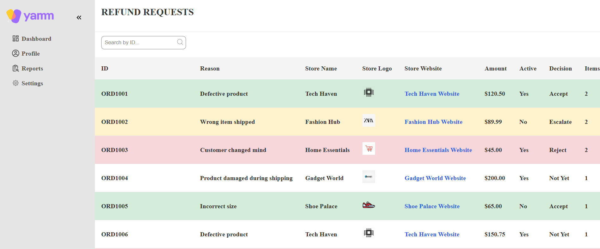
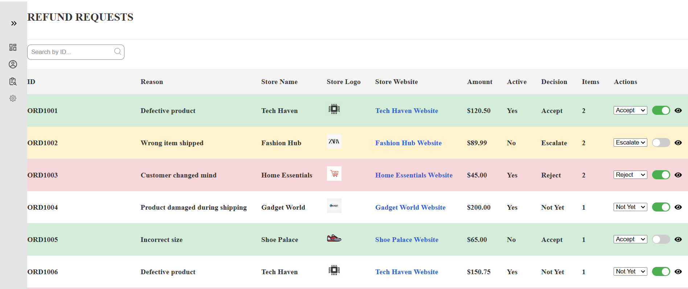
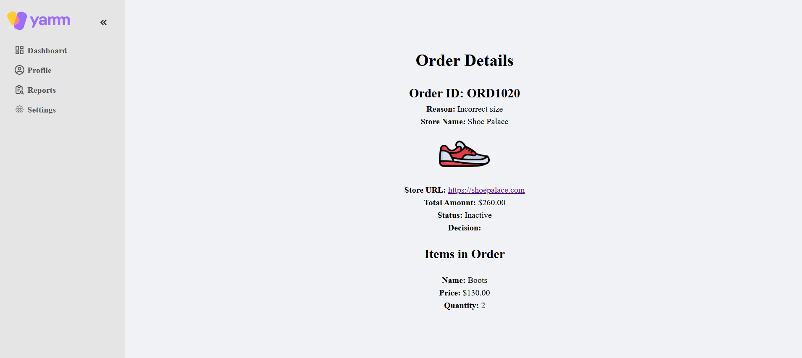

# Yamm Dashboard

This is a simple dashboard task submitted as part of an assignment. The project includes a responsive sidebar, a dynamic table, and an order item page. The table fetches data from a dummy `db.json` file served by `json-server`, and users can interact with the table to change decisions, toggle active status, and navigate to item details.
## Images


<div align="center">






</div>

## Features

- **Responsive Sidebar**: Navigate between different pages.
- **Dynamic Paginated Table**: Fetches data from a `db.json` file with 15 result per page.
-  **Search Bar**: Allows users to search for orders by ID.
- **Interactive Actions**:
  - Change decision using a select element.
  - Toggle active status using a switch component.
  - Navigate to item details using an icon.
- **Order Item Page**: Displays details about the selected item.

## Libraries Used

- **React**: JavaScript library for building user interfaces.
- **Vite**: Fast build tool for modern web projects.
- **React Router DOM**: For routing between pages.
- **JSON Server**: Simulates a REST API using a `db.json` file.
- **React Icons**: Provides icons for the UI.
- **Styled Components**: For styling React components.
- **React Toastify**: Displays toast notifications.

## Installation

1. **Clone the repository**:
   ```bash
   git clone https://github.com/rashaaad19/Yamm-Dashboard
   cd Yamm-Dashboard
   ```

2. **Install dependencies**:
   ```bash
   npm install
   ```

3. **Run JSON Server**:
   - Open a terminal inside the `data` folder.
   - Run the following command to start the JSON server:
     ```bash
     npx json-server db.json
     ```

4. **Run the React application**:
   - Open a new terminal in the root of the project.
   - Start the development server using Vite:
     ```bash
     npm run dev
     ```

5. **Access the application**:
   - Open your browser and navigate to `http://localhost:5173` (or the port specified by Vite).

## Project Structure

```
.
├── node_modules
├── src
│   ├── Components
│   ├── data
│   ├── hooks
│   ├── Pages
│   ├── App.css
│   ├── App.jsx
│   ├── index.css
│   ├── main.jsx
├── .gitignore
├── eslint.config.js
├── index.html
├── package-lock.json
├── package.json
├── README.md
├── vite.config.js
```

## Usage

- **Sidebar**: Use the sidebar to navigate between different pages.
- **Table**: Interact with the table to change decisions, toggle active status, and view item details.
- **Order Item Page**: Displays detailed information about the selected item.

## Contributing

This project is a task submission and is not open for contributions.

## License

This project is licensed under the MIT License. See the [LICENSE](LICENSE) file for details.

---

